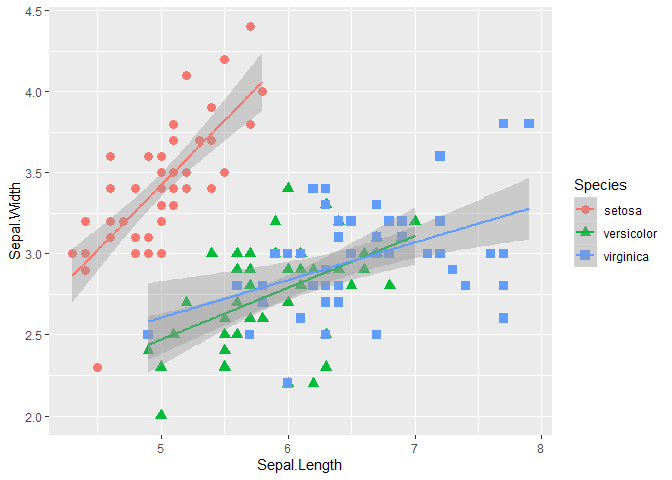
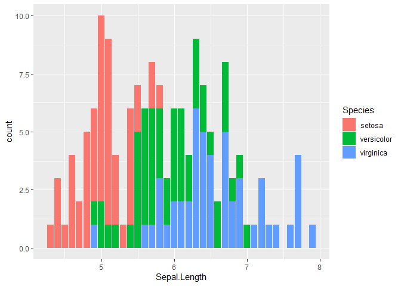

Class 07
================
Sarra Larif
1/28/2020

``` r
source("http://tinyurl.com/rescale-R")
```

``` r
function(x, na.rm=TRUE, plot=FALSE, ...) {
  # Our rescale function from lecture 6
  if( !is.numeric(x) ) {
    stop("Input x should be numeric", call.=FALSE)
  }
  rng <-range(x, na.rm=TRUE)
  answer <- (x - rng[1]) / (rng[2] - rng[1])
  if(plot) { 
    plot(answer, ...) 
  }

  return(answer)
}
```

    ## function(x, na.rm=TRUE, plot=FALSE, ...) {
    ##   # Our rescale function from lecture 6
    ##   if( !is.numeric(x) ) {
    ##     stop("Input x should be numeric", call.=FALSE)
    ##   }
    ##   rng <-range(x, na.rm=TRUE)
    ##   answer <- (x - rng[1]) / (rng[2] - rng[1])
    ##   if(plot) { 
    ##     plot(answer, ...) 
    ##   }
    ## 
    ##   return(answer)
    ## }

\#Warning/Stop Functions `warning` gives a warning text and keeps the
function going `stop` gives a warning message and breaks the code `!` in
front of variable means not i.e. `!TRUE = FALSE` In the rescale function
above: rescale only works on numbers so `!is.numeric` gives if the input
is NOT numeric (i.e. purple) then it will return TRUE and the `stop` but
if it is numeric, it will give FALSE and skip the `stop`

``` r
is.numeric(40)
```

    ## [1] TRUE

``` r
!is.numeric(40)
```

    ## [1] FALSE

``` r
x <-  c(1, 2, NA, 3, NA)
y <-  c(NA, 3, NA, 3, 4)
typeof(x)
```

    ## [1] "double"

``` r
is.numeric(x)
```

    ## [1] TRUE

``` r
is.na(x)
```

    ## [1] FALSE FALSE  TRUE FALSE  TRUE

``` r
typeof(is.numeric(x))
```

    ## [1] "logical"

``` r
z <- c("dvnsivf", 2, NA, 3, NA)
is.na(z)
```

    ## [1] FALSE FALSE  TRUE FALSE  TRUE

``` r
#is.na works for characters too
```

"\`\`\`{r}

is.both.na \<- function (x,y) { is.na(x) & is.na(y) } is.both.na(x, y)

a \<- c(4, 5, NA, 8) b \<- c(NA, 9, NA, 18, 2) is.both.na(a, b)

is.both.na1 \<- function(x,y) { if(length(x) \!= length(y)){ stop(“your
inputs aren’t the same length”) } is.na(x) & is.na (y) } is.both.na1(a,
b)

```` "


```r
rescale_new <-  function(x, y) {
  ## Print some info on where NA's are as well as the number of them 
  if(length(x) != length(y)) {
    stop("Input x and y should be vectors of the same length", call.=FALSE)
  }
  na.in.both <- ( is.na(x) & is.na(y) )
  na.number  <- sum(na.in.both) #Gives how many NAs are there
  na.which   <- which(na.in.both) #Gives position of NAs

  message("Found ", na.number, " NA's at position(s):", 
          paste(na.which, collapse=", ") ) 
  
  return( list(number=na.number, which=na.which) )
}
rescale_new(x,y)
````

    ## Found 1 NA's at position(s):3

    ## $number
    ## [1] 1
    ## 
    ## $which
    ## [1] 3

``` r
truth_vector <- c(FALSE, TRUE, FALSE, TRUE)
which(truth_vector)
```

    ## [1] 2 4

\#Data Frames Data frames are tables that allow you to do special
functions on

``` r
df1
```

    ##     IDs exp
    ## 1 gene1   2
    ## 2 gene2   1
    ## 3 gene3   1

``` r
df1[1,1]
```

    ## [1] "gene1"

``` r
df1[1,]
```

    ##     IDs exp
    ## 1 gene1   2

First variable is row, second is column

Can look at row/column headers

``` r
df1[, "IDs"]
```

    ## [1] "gene1" "gene2" "gene3"

``` r
df1$IDs
```

    ## [1] "gene1" "gene2" "gene3"

Can clean up global space

``` r
rm(x)
rm(y)
rm(z)
rm(a)
```

    ## Warning in rm(a): object 'a' not found

``` r
rm(b)
```

    ## Warning in rm(b): object 'b' not found

``` r
rm(truth_vector)
```

Look at difference between IDs in 2 data frames

``` r
x <- df1$IDs
y <- df2$IDs

x
```

    ## [1] "gene1" "gene2" "gene3"

``` r
y 
```

    ## [1] "gene2" "gene4" "gene3" "gene5"

``` r
intersect(x,y) #which genes are in BOTH data sets?
```

    ## [1] "gene2" "gene3"

``` r
x %in% y #which elements of x exist in y?
```

    ## [1] FALSE  TRUE  TRUE

``` r
x[x %in% y] #subsets variables in x that are also in y
```

    ## [1] "gene2" "gene3"

``` r
y %in% x
```

    ## [1]  TRUE FALSE  TRUE FALSE

``` r
y[y %in% x]
```

    ## [1] "gene2" "gene3"

We want to make a matrix of x elements in y and y elements in x

``` r
  cbind(x[ x %in% y], y[y %in% x])
```

    ##      [,1]    [,2]   
    ## [1,] "gene2" "gene2"
    ## [2,] "gene3" "gene3"

Can make a function out of something we already typed by highlighting
that code and then pressing code on top bar and pressing extract
function or control+alt+x

``` r
gene_interect <- function(x, y) {
  cbind(x[ x %in% y], y[y %in% x])
}

gene_intersect(x,y)
```

    ##      [,1]    [,2]   
    ## [1,] "gene2" "gene2"
    ## [2,] "gene3" "gene3"

Want to take data frames and have the function intersect for us

``` r
#Need to change x and y to the data frames so it works with any data frame not just the ones we stored into the variables 
gene_interect2 <- function(df1, df2) {
  cbind(df1[df1$IDs %in% df2$IDs, ], df2[df2$IDs %in% df1$IDs, ], "exp") 
  #Add comme after %in% function within bracket to get all information associated with what is within the data
}

x <- df1$IDs
y <- df2$IDs
```

Want to add functionality “\`\`\`{r} gene\_interect3 \<- function(df1,
df2, gene.colname =”IDs") {

cbind(df1\[df1\[, gene.colname\] %in% df2\[, gene.colname\],\],
df2\[df2\[, gene.colname\] %in% df1\[, gene.colname\], \], “exp”)

}

\#These are all the same and we want to add this functionality so we can
subset with different columns in future df1$IDs df1\[, “new\_name”\]
gene.colname = “new\_name” df1\[, gene.colname\]

colnames(df1) \<- c(“new\_name”, “exp”) colnames(df2) \<- c(“new\_name”,
“exp”) \#change column name in data frame

gene\_intersect3(df1, df2, gene.colname = “new\_name”)

```` "
 
 Cleaning up the code
"```{r}
gene_interesect4 <- function(df1, df2, gene.colname = "IDs") {
  
  df1.name <- df1[, gene.colname]
  df2.name <- df2[, gene.colname]
  
  df1.inds <- df1.name %in% df2.name
  df2.inds <- df2.name %in% df1.name
  
  cbind(df1[df1.inds,], df2[df2.inds,], "exp")
}

gene_intersect4(df1, df2, gene.colname = "new_name")
```"
 
#Installing Packages
`install.packages('ggplot2')`

```r
library("ggplot2")
````

R graph gallery on google shows you all the different graphs you can
make in R `ggplot` only takes data frames

``` r
dim(iris) #a built-in data set; dim = dimensions -> 150 x 5 dataframe
```

    ## [1] 150   5

``` r
head(iris)
```

    ##   Sepal.Length Sepal.Width Petal.Length Petal.Width Species
    ## 1          5.1         3.5          1.4         0.2  setosa
    ## 2          4.9         3.0          1.4         0.2  setosa
    ## 3          4.7         3.2          1.3         0.2  setosa
    ## 4          4.6         3.1          1.5         0.2  setosa
    ## 5          5.0         3.6          1.4         0.2  setosa
    ## 6          5.4         3.9          1.7         0.4  setosa

``` r
levels(iris$species)
```

    ## NULL

``` r
#Specifying how to present data visually
myplot <- ggplot(data = iris, aes(x=sepal.length, #Data on x axis
                                   y=sepal.width)) #Data on y axis
class(myplot)
```

    ## [1] "gg"     "ggplot"

``` r
ggplot(data = iris, aes(Sepal.Length, Sepal.Width, color = Species)) + geom_point((aes(shape = Species)), size = 3) +geom_smooth(method = "lm")
```

<!-- -->

``` r
#make sure to add + because ggplot adds data layer by layer
#color/shape = species plots the data of species by color/shape
# lm = linear modeling; shaded region is confidence interval 
```

Bar Plot

``` r
ggplot(iris, aes(Sepal.Length, fill = Species)) + geom_bar(stat = "count")
```

<!-- -->

``` r
#only need one variable
#alpha = transparency 
# can also add vertical lines for medians 
#can change background
ggplot(iris)
```

<!-- -->

rstudio.com/cheatsheet gives cheatsheet for different ggplots

\#Group Work
