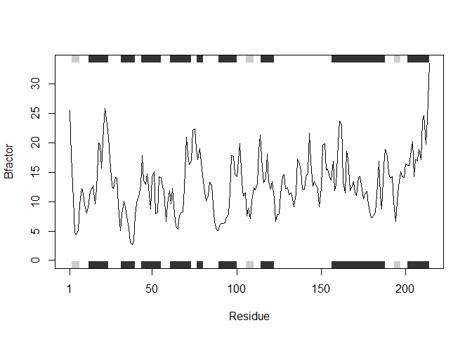

Class 6: R Functions
================
Sarra Larif
1/23/2020

\#Functions

## Level 2 Heading

### Level 3 Heading

``` r
#this is a silly plot
plot(1:5)
```

<!-- --> Any text in
R markdown is just text, need to do insert (cntrl+alt+i) to add R code

Lets see more about file import (i.e. reading files into R). The main
read function in base R is `read.table()`

`read.csv` has different defaults

``` r
t1 <- read.csv("test1.txt")
t1
```

    ##   Col1 Col2 Col3
    ## 1    1    2    3
    ## 2    4    5    6
    ## 3    7    8    9
    ## 4    a    b    c

``` r
t2 <- read.table("test2.txt", sep = "$", header = TRUE)
t2
```

    ##   Col1 Col2 Col3
    ## 1    1    2    3
    ## 2    4    5    6
    ## 3    7    8    9
    ## 4    a    b    c

``` r
t3 <- read.table("test3.txt")
t3
```

    ##   V1 V2 V3
    ## 1  1  6  a
    ## 2  2  7  b
    ## 3  3  8  c
    ## 4  4  9  d
    ## 5  5 10  e

``` r
add <- function(x, y = 1) {
  #sum the input x and y
  x + y
}
add(5)
```

    ## [1] 6

Green play button sends code to “R brain”

Let’s use the new function

``` r
add(175, 3)
```

    ## [1] 178

How does this work with vector inputs?

``` r
add(c(5, 7, 2, 9))
```

    ## [1]  6  8  3 10

It just added 1 to each.

``` r
add(c(1, 2, 4), 4)
```

    ## [1] 5 6 8

It added 4 to each.

``` r
add(c(1, 2, 4), c(1, 2, 4))
```

    ## [1] 2 4 8

``` r
#add(c(1,2,4), 1, 2, 4) brings an error:unusued arguments
```

What is this `range()` function?

``` r
x <- c(4,4,10,3,11)
max(x)
```

    ## [1] 11

``` r
min(x)
```

    ## [1] 3

``` r
range(x)
```

    ## [1]  3 11

``` r
rescale <- function(x) {
 rng <-range(x)
 (x - rng[1]) / (rng[2] - rng[1])
}
rescale(x)
```

    ## [1] 0.125 0.125 0.875 0.000 1.000

Do some more testing

``` r
rescale(1:10)
```

    ##  [1] 0.0000000 0.1111111 0.2222222 0.3333333 0.4444444 0.5555556 0.6666667
    ##  [8] 0.7777778 0.8888889 1.0000000

How to get function to work here where there is an NA

``` r
rescale(c(1, 2, NA, 3, 10))
```

    ## [1] NA NA NA NA NA

``` r
x <- c(1, 2, NA, 3, 10)
rng <-  range(x, na.rm = TRUE)
rng
```

    ## [1]  1 10

``` r
rescale2 <- function(x) {
 rng <-range(x, na.rm = TRUE)
 (x - rng[1]) / (rng[2] - rng[1])
}
rescale2(x)
```

    ## [1] 0.0000000 0.1111111        NA 0.2222222 1.0000000

``` r
rescale3 <- function(x, na.rm=TRUE, plot=FALSE) {
 rng <-range(x, na.rm=na.rm)
 print("Hello")
 answer <- (x - rng[1]) / (rng[2] - rng[1])
 print("is it me you are looking for?")
 if(plot) {
 plot(answer, typ="b", lwd=4)
 }
 print("I can see it in ...")
 return(answer)
}

rescale3(x)
```

    ## [1] "Hello"
    ## [1] "is it me you are looking for?"
    ## [1] "I can see it in ..."

    ## [1] 0.0000000 0.1111111        NA 0.2222222 1.0000000

``` r
rescale3 <- function(x, na.rm=TRUE, plot=FALSE) {
 rng <-range(x, na.rm=na.rm)
 print("Hello")
 answer <- (x - rng[1]) / (rng[2] - rng[1])
 print("is it me you are looking for?")
 if(plot) {
   print("Don't sing again please!")
 plot(answer, typ="b", lwd=4)
 }
 print("I can see it in ...")
 return(answer)
}

rescale3(x, plot = TRUE)
```

    ## [1] "Hello"
    ## [1] "is it me you are looking for?"
    ## [1] "Don't sing again please!"

<!-- -->

    ## [1] "I can see it in ..."

    ## [1] 0.0000000 0.1111111        NA 0.2222222 1.0000000

Do not put install commands in markdown or it will try to install the
package every time you render the file

Can you improve this code?

``` r
library(bio3d)
s1 <- read.pdb("4AKE") # kinase with drug
```

    ##   Note: Accessing on-line PDB file

``` r
s2 <- read.pdb("1AKE") # kinase no drug
```

    ##   Note: Accessing on-line PDB file
    ##    PDB has ALT records, taking A only, rm.alt=TRUE

``` r
s3 <- read.pdb("1E4Y") # kinase with drug
```

    ##   Note: Accessing on-line PDB file

``` r
s1.chainA <- trim.pdb(s1, chain="A", elety="CA")
s2.chainA <- trim.pdb(s2, chain="A", elety="CA")
s3.chainA <- trim.pdb(s3, chain="A", elety="CA")

s1.b <- s1.chainA$atom$b
s2.b <- s2.chainA$atom$b
s3.b <- s3.chainA$atom$b

plotb3(s1.b, sse=s1.chainA, typ="l", ylab="Bfactor")
```

<!-- -->

``` r
plotb3(s2.b, sse=s2.chainA, typ="l", ylab="Bfactor")
```

<!-- -->

``` r
plotb3(s3.b, sse=s3.chainA, typ="l", ylab="Bfactor")
```

<!-- --> Plot is
measure of flexibility along sequence from c to n (higher peak = more
it’s moving)

Questions: Q1. `read.pdb()` provides a file in the global environment
that gives data from PDB on the protein It’s a large list of 8 things
and of class “pdb”, “sse”

``` r
class(s1)
```

    ## [1] "pdb" "sse"

``` r
str(s1)
```

    ## List of 8
    ##  $ atom  :'data.frame':  3459 obs. of  16 variables:
    ##   ..$ type  : chr [1:3459] "ATOM" "ATOM" "ATOM" "ATOM" ...
    ##   ..$ eleno : int [1:3459] 1 2 3 4 5 6 7 8 9 10 ...
    ##   ..$ elety : chr [1:3459] "N" "CA" "C" "O" ...
    ##   ..$ alt   : chr [1:3459] NA NA NA NA ...
    ##   ..$ resid : chr [1:3459] "MET" "MET" "MET" "MET" ...
    ##   ..$ chain : chr [1:3459] "A" "A" "A" "A" ...
    ##   ..$ resno : int [1:3459] 1 1 1 1 1 1 1 1 2 2 ...
    ##   ..$ insert: chr [1:3459] NA NA NA NA ...
    ##   ..$ x     : num [1:3459] -10.93 -9.9 -9.17 -9.8 -10.59 ...
    ##   ..$ y     : num [1:3459] -24.9 -24.4 -23.3 -22.3 -24 ...
    ##   ..$ z     : num [1:3459] -9.52 -10.48 -9.81 -9.35 -11.77 ...
    ##   ..$ o     : num [1:3459] 1 1 1 1 1 1 1 1 1 1 ...
    ##   ..$ b     : num [1:3459] 41.5 29 27.9 26.4 34.2 ...
    ##   ..$ segid : chr [1:3459] NA NA NA NA ...
    ##   ..$ elesy : chr [1:3459] "N" "C" "C" "O" ...
    ##   ..$ charge: chr [1:3459] NA NA NA NA ...
    ##  $ xyz   : 'xyz' num [1, 1:10377] -10.93 -24.89 -9.52 -9.9 -24.42 ...
    ##  $ seqres: Named chr [1:428] "MET" "ARG" "ILE" "ILE" ...
    ##   ..- attr(*, "names")= chr [1:428] "A" "A" "A" "A" ...
    ##  $ helix :List of 4
    ##   ..$ start: Named num [1:19] 13 31 44 61 75 90 113 161 202 13 ...
    ##   .. ..- attr(*, "names")= chr [1:19] "" "" "" "" ...
    ##   ..$ end  : Named num [1:19] 24 40 54 73 77 98 121 187 213 24 ...
    ##   .. ..- attr(*, "names")= chr [1:19] "" "" "" "" ...
    ##   ..$ chain: chr [1:19] "A" "A" "A" "A" ...
    ##   ..$ type : chr [1:19] "5" "1" "1" "1" ...
    ##  $ sheet :List of 4
    ##   ..$ start: Named num [1:14] 192 105 2 81 27 123 131 192 105 2 ...
    ##   .. ..- attr(*, "names")= chr [1:14] "" "" "" "" ...
    ##   ..$ end  : Named num [1:14] 197 110 7 84 29 126 134 197 110 7 ...
    ##   .. ..- attr(*, "names")= chr [1:14] "" "" "" "" ...
    ##   ..$ chain: chr [1:14] "A" "A" "A" "A" ...
    ##   ..$ sense: chr [1:14] "0" "1" "1" "1" ...
    ##  $ calpha: logi [1:3459] FALSE TRUE FALSE FALSE FALSE FALSE ...
    ##  $ remark:List of 1
    ##   ..$ biomat:List of 4
    ##   .. ..$ num   : int 1
    ##   .. ..$ chain :List of 1
    ##   .. .. ..$ : chr [1:2] "A" "B"
    ##   .. ..$ mat   :List of 1
    ##   .. .. ..$ :List of 1
    ##   .. .. .. ..$ A B: num [1:3, 1:4] 1 0 0 0 1 0 0 0 1 0 ...
    ##   .. ..$ method: chr "AUTHOR"
    ##  $ call  : language read.pdb(file = "4AKE")
    ##  - attr(*, "class")= chr [1:2] "pdb" "sse"

``` r
s1$seqres
```

    ##     A     A     A     A     A     A     A     A     A     A     A     A     A 
    ## "MET" "ARG" "ILE" "ILE" "LEU" "LEU" "GLY" "ALA" "PRO" "GLY" "ALA" "GLY" "LYS" 
    ##     A     A     A     A     A     A     A     A     A     A     A     A     A 
    ## "GLY" "THR" "GLN" "ALA" "GLN" "PHE" "ILE" "MET" "GLU" "LYS" "TYR" "GLY" "ILE" 
    ##     A     A     A     A     A     A     A     A     A     A     A     A     A 
    ## "PRO" "GLN" "ILE" "SER" "THR" "GLY" "ASP" "MET" "LEU" "ARG" "ALA" "ALA" "VAL" 
    ##     A     A     A     A     A     A     A     A     A     A     A     A     A 
    ## "LYS" "SER" "GLY" "SER" "GLU" "LEU" "GLY" "LYS" "GLN" "ALA" "LYS" "ASP" "ILE" 
    ##     A     A     A     A     A     A     A     A     A     A     A     A     A 
    ## "MET" "ASP" "ALA" "GLY" "LYS" "LEU" "VAL" "THR" "ASP" "GLU" "LEU" "VAL" "ILE" 
    ##     A     A     A     A     A     A     A     A     A     A     A     A     A 
    ## "ALA" "LEU" "VAL" "LYS" "GLU" "ARG" "ILE" "ALA" "GLN" "GLU" "ASP" "CYS" "ARG" 
    ##     A     A     A     A     A     A     A     A     A     A     A     A     A 
    ## "ASN" "GLY" "PHE" "LEU" "LEU" "ASP" "GLY" "PHE" "PRO" "ARG" "THR" "ILE" "PRO" 
    ##     A     A     A     A     A     A     A     A     A     A     A     A     A 
    ## "GLN" "ALA" "ASP" "ALA" "MET" "LYS" "GLU" "ALA" "GLY" "ILE" "ASN" "VAL" "ASP" 
    ##     A     A     A     A     A     A     A     A     A     A     A     A     A 
    ## "TYR" "VAL" "LEU" "GLU" "PHE" "ASP" "VAL" "PRO" "ASP" "GLU" "LEU" "ILE" "VAL" 
    ##     A     A     A     A     A     A     A     A     A     A     A     A     A 
    ## "ASP" "ARG" "ILE" "VAL" "GLY" "ARG" "ARG" "VAL" "HIS" "ALA" "PRO" "SER" "GLY" 
    ##     A     A     A     A     A     A     A     A     A     A     A     A     A 
    ## "ARG" "VAL" "TYR" "HIS" "VAL" "LYS" "PHE" "ASN" "PRO" "PRO" "LYS" "VAL" "GLU" 
    ##     A     A     A     A     A     A     A     A     A     A     A     A     A 
    ## "GLY" "LYS" "ASP" "ASP" "VAL" "THR" "GLY" "GLU" "GLU" "LEU" "THR" "THR" "ARG" 
    ##     A     A     A     A     A     A     A     A     A     A     A     A     A 
    ## "LYS" "ASP" "ASP" "GLN" "GLU" "GLU" "THR" "VAL" "ARG" "LYS" "ARG" "LEU" "VAL" 
    ##     A     A     A     A     A     A     A     A     A     A     A     A     A 
    ## "GLU" "TYR" "HIS" "GLN" "MET" "THR" "ALA" "PRO" "LEU" "ILE" "GLY" "TYR" "TYR" 
    ##     A     A     A     A     A     A     A     A     A     A     A     A     A 
    ## "SER" "LYS" "GLU" "ALA" "GLU" "ALA" "GLY" "ASN" "THR" "LYS" "TYR" "ALA" "LYS" 
    ##     A     A     A     A     A     A     A     A     A     A     A     A     A 
    ## "VAL" "ASP" "GLY" "THR" "LYS" "PRO" "VAL" "ALA" "GLU" "VAL" "ARG" "ALA" "ASP" 
    ##     A     A     A     A     A     A     B     B     B     B     B     B     B 
    ## "LEU" "GLU" "LYS" "ILE" "LEU" "GLY" "MET" "ARG" "ILE" "ILE" "LEU" "LEU" "GLY" 
    ##     B     B     B     B     B     B     B     B     B     B     B     B     B 
    ## "ALA" "PRO" "GLY" "ALA" "GLY" "LYS" "GLY" "THR" "GLN" "ALA" "GLN" "PHE" "ILE" 
    ##     B     B     B     B     B     B     B     B     B     B     B     B     B 
    ## "MET" "GLU" "LYS" "TYR" "GLY" "ILE" "PRO" "GLN" "ILE" "SER" "THR" "GLY" "ASP" 
    ##     B     B     B     B     B     B     B     B     B     B     B     B     B 
    ## "MET" "LEU" "ARG" "ALA" "ALA" "VAL" "LYS" "SER" "GLY" "SER" "GLU" "LEU" "GLY" 
    ##     B     B     B     B     B     B     B     B     B     B     B     B     B 
    ## "LYS" "GLN" "ALA" "LYS" "ASP" "ILE" "MET" "ASP" "ALA" "GLY" "LYS" "LEU" "VAL" 
    ##     B     B     B     B     B     B     B     B     B     B     B     B     B 
    ## "THR" "ASP" "GLU" "LEU" "VAL" "ILE" "ALA" "LEU" "VAL" "LYS" "GLU" "ARG" "ILE" 
    ##     B     B     B     B     B     B     B     B     B     B     B     B     B 
    ## "ALA" "GLN" "GLU" "ASP" "CYS" "ARG" "ASN" "GLY" "PHE" "LEU" "LEU" "ASP" "GLY" 
    ##     B     B     B     B     B     B     B     B     B     B     B     B     B 
    ## "PHE" "PRO" "ARG" "THR" "ILE" "PRO" "GLN" "ALA" "ASP" "ALA" "MET" "LYS" "GLU" 
    ##     B     B     B     B     B     B     B     B     B     B     B     B     B 
    ## "ALA" "GLY" "ILE" "ASN" "VAL" "ASP" "TYR" "VAL" "LEU" "GLU" "PHE" "ASP" "VAL" 
    ##     B     B     B     B     B     B     B     B     B     B     B     B     B 
    ## "PRO" "ASP" "GLU" "LEU" "ILE" "VAL" "ASP" "ARG" "ILE" "VAL" "GLY" "ARG" "ARG" 
    ##     B     B     B     B     B     B     B     B     B     B     B     B     B 
    ## "VAL" "HIS" "ALA" "PRO" "SER" "GLY" "ARG" "VAL" "TYR" "HIS" "VAL" "LYS" "PHE" 
    ##     B     B     B     B     B     B     B     B     B     B     B     B     B 
    ## "ASN" "PRO" "PRO" "LYS" "VAL" "GLU" "GLY" "LYS" "ASP" "ASP" "VAL" "THR" "GLY" 
    ##     B     B     B     B     B     B     B     B     B     B     B     B     B 
    ## "GLU" "GLU" "LEU" "THR" "THR" "ARG" "LYS" "ASP" "ASP" "GLN" "GLU" "GLU" "THR" 
    ##     B     B     B     B     B     B     B     B     B     B     B     B     B 
    ## "VAL" "ARG" "LYS" "ARG" "LEU" "VAL" "GLU" "TYR" "HIS" "GLN" "MET" "THR" "ALA" 
    ##     B     B     B     B     B     B     B     B     B     B     B     B     B 
    ## "PRO" "LEU" "ILE" "GLY" "TYR" "TYR" "SER" "LYS" "GLU" "ALA" "GLU" "ALA" "GLY" 
    ##     B     B     B     B     B     B     B     B     B     B     B     B     B 
    ## "ASN" "THR" "LYS" "TYR" "ALA" "LYS" "VAL" "ASP" "GLY" "THR" "LYS" "PRO" "VAL" 
    ##     B     B     B     B     B     B     B     B     B     B     B     B 
    ## "ALA" "GLU" "VAL" "ARG" "ALA" "ASP" "LEU" "GLU" "LYS" "ILE" "LEU" "GLY"

A/B = chain A sequences and chain B sequences

``` r
aa321(s1$seqres)
```

    ##   [1] "M" "R" "I" "I" "L" "L" "G" "A" "P" "G" "A" "G" "K" "G" "T" "Q" "A" "Q"
    ##  [19] "F" "I" "M" "E" "K" "Y" "G" "I" "P" "Q" "I" "S" "T" "G" "D" "M" "L" "R"
    ##  [37] "A" "A" "V" "K" "S" "G" "S" "E" "L" "G" "K" "Q" "A" "K" "D" "I" "M" "D"
    ##  [55] "A" "G" "K" "L" "V" "T" "D" "E" "L" "V" "I" "A" "L" "V" "K" "E" "R" "I"
    ##  [73] "A" "Q" "E" "D" "C" "R" "N" "G" "F" "L" "L" "D" "G" "F" "P" "R" "T" "I"
    ##  [91] "P" "Q" "A" "D" "A" "M" "K" "E" "A" "G" "I" "N" "V" "D" "Y" "V" "L" "E"
    ## [109] "F" "D" "V" "P" "D" "E" "L" "I" "V" "D" "R" "I" "V" "G" "R" "R" "V" "H"
    ## [127] "A" "P" "S" "G" "R" "V" "Y" "H" "V" "K" "F" "N" "P" "P" "K" "V" "E" "G"
    ## [145] "K" "D" "D" "V" "T" "G" "E" "E" "L" "T" "T" "R" "K" "D" "D" "Q" "E" "E"
    ## [163] "T" "V" "R" "K" "R" "L" "V" "E" "Y" "H" "Q" "M" "T" "A" "P" "L" "I" "G"
    ## [181] "Y" "Y" "S" "K" "E" "A" "E" "A" "G" "N" "T" "K" "Y" "A" "K" "V" "D" "G"
    ## [199] "T" "K" "P" "V" "A" "E" "V" "R" "A" "D" "L" "E" "K" "I" "L" "G" "M" "R"
    ## [217] "I" "I" "L" "L" "G" "A" "P" "G" "A" "G" "K" "G" "T" "Q" "A" "Q" "F" "I"
    ## [235] "M" "E" "K" "Y" "G" "I" "P" "Q" "I" "S" "T" "G" "D" "M" "L" "R" "A" "A"
    ## [253] "V" "K" "S" "G" "S" "E" "L" "G" "K" "Q" "A" "K" "D" "I" "M" "D" "A" "G"
    ## [271] "K" "L" "V" "T" "D" "E" "L" "V" "I" "A" "L" "V" "K" "E" "R" "I" "A" "Q"
    ## [289] "E" "D" "C" "R" "N" "G" "F" "L" "L" "D" "G" "F" "P" "R" "T" "I" "P" "Q"
    ## [307] "A" "D" "A" "M" "K" "E" "A" "G" "I" "N" "V" "D" "Y" "V" "L" "E" "F" "D"
    ## [325] "V" "P" "D" "E" "L" "I" "V" "D" "R" "I" "V" "G" "R" "R" "V" "H" "A" "P"
    ## [343] "S" "G" "R" "V" "Y" "H" "V" "K" "F" "N" "P" "P" "K" "V" "E" "G" "K" "D"
    ## [361] "D" "V" "T" "G" "E" "E" "L" "T" "T" "R" "K" "D" "D" "Q" "E" "E" "T" "V"
    ## [379] "R" "K" "R" "L" "V" "E" "Y" "H" "Q" "M" "T" "A" "P" "L" "I" "G" "Y" "Y"
    ## [397] "S" "K" "E" "A" "E" "A" "G" "N" "T" "K" "Y" "A" "K" "V" "D" "G" "T" "K"
    ## [415] "P" "V" "A" "E" "V" "R" "A" "D" "L" "E" "K" "I" "L" "G"

Q2. `trim.pdb()` provides the same data as read.pdb but with less
information (subset of data) “produce a new smaller PDB object,
containing a subset of atoms, from a given larger PDB object”

Q3. removing `sse` removes the grey rectangles in the plot which
represents what the secondary structure of the protein is (helix, sheet,
turn)

Q4. Combining the plots

``` r
plotb3(s1.b, sse=s1.chainA, typ="l", lwd = 2, ylab="Bfactor")
points(s2.b, typ = "l", col = "blue", lwd = 2)
points(s3.b, typ = "l", col = "green", lwd = 2)
```

<!-- -->

Q5. 2 and 3

``` r
hc <- hclust( dist( rbind(s1.b, s2.b, s3.b) ) )
plot(hc)
```

<!-- --> Quantify
with `dist( rbind(s1.b, s2.b, s3.b) )` which provides the distances
between each protein
