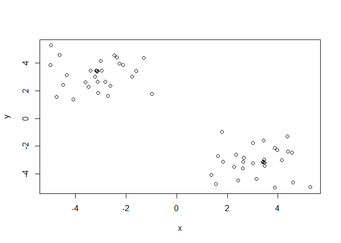
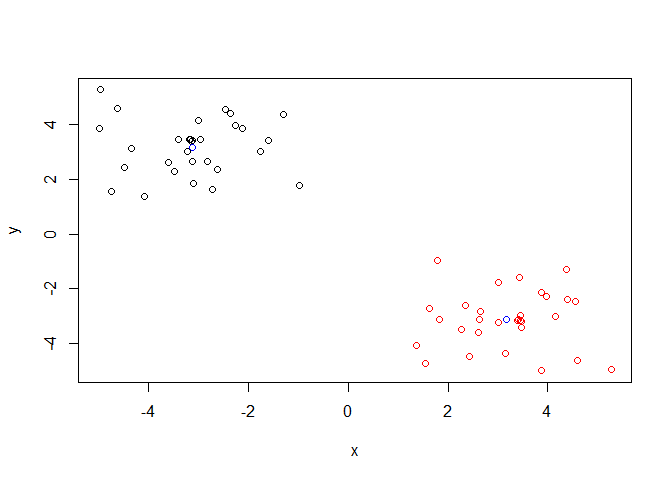
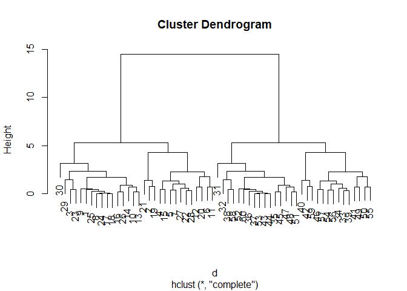
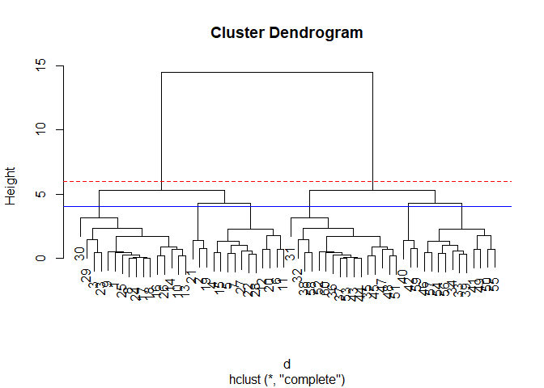
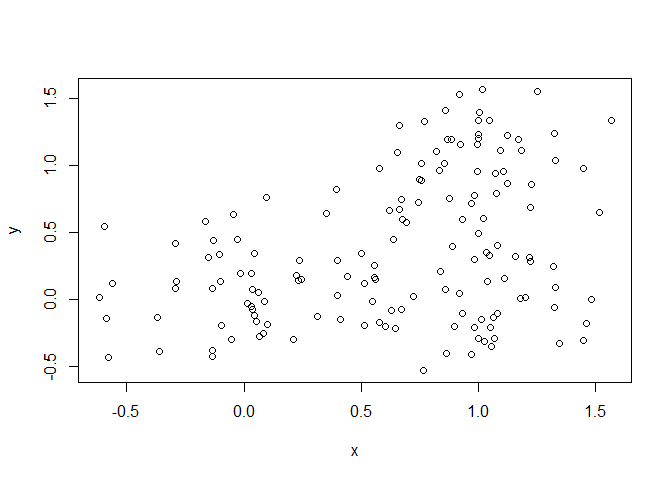
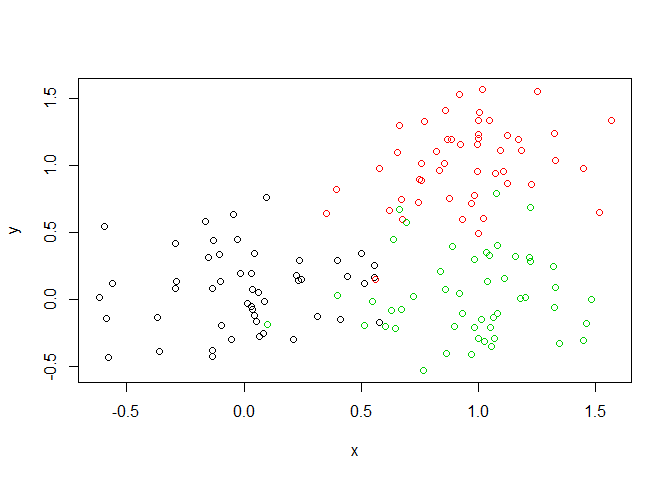
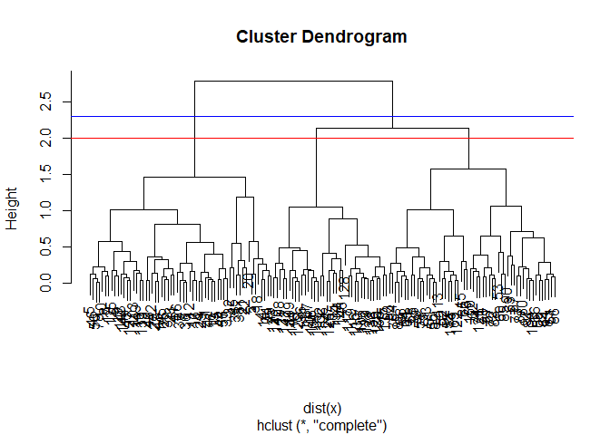
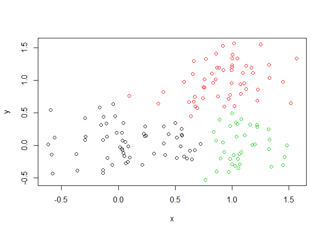
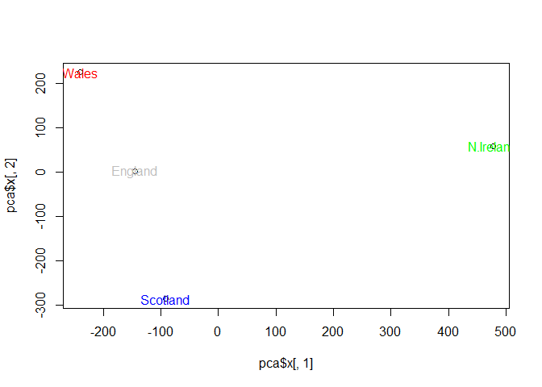

Class 09
================
Sarra Larif
2/4/2020

\#\#K-means clustering K-means clustering: tries to group things into
similar categories k=3: group things into 3 groups (`center=3`) each
point added updates the mean cluster point (representative point) after
finding variation, it starts over by picking 3 different random points
and doing everything again until it finds least amount of variation one
cycle - one iteration Use “scree plot” to look for biggest drop of Total
within SS to determine what k should be rather than doing trial/error

``` r
tmp <- c(rnorm(30,-3), rnorm(30,3))
x <- cbind(x=tmp, y=rev(tmp)) 
plot(x)
```

<!-- -->

``` r
km <- kmeans(x, centers = 2, nstart=20)
km
```

    ## K-means clustering with 2 clusters of sizes 30, 30
    ## 
    ## Cluster means:
    ##           x         y
    ## 1 -3.122039  3.179131
    ## 2  3.179131 -3.122039
    ## 
    ## Clustering vector:
    ##  [1] 1 1 1 1 1 1 1 1 1 1 1 1 1 1 1 1 1 1 1 1 1 1 1 1 1 1 1 1 1 1 2 2 2 2 2 2 2 2
    ## [39] 2 2 2 2 2 2 2 2 2 2 2 2 2 2 2 2 2 2 2 2 2 2
    ## 
    ## Within cluster sum of squares by cluster:
    ## [1] 61.04047 61.04047
    ##  (between_SS / total_SS =  90.7 %)
    ## 
    ## Available components:
    ## 
    ## [1] "cluster"      "centers"      "totss"        "withinss"     "tot.withinss"
    ## [6] "betweenss"    "size"         "iter"         "ifault"

Use the kmeans() function setting k to 2 and nstart=20 Inspect/print the
results Q. How many points are in each cluster? 30 Q. What ‘component’
of your result object details - cluster size? “size” - cluster
assignment/membership? “cluster” - cluster center? “centers”

``` r
km$size
```

    ## [1] 30 30

``` r
km$cluster
```

    ##  [1] 1 1 1 1 1 1 1 1 1 1 1 1 1 1 1 1 1 1 1 1 1 1 1 1 1 1 1 1 1 1 2 2 2 2 2 2 2 2
    ## [39] 2 2 2 2 2 2 2 2 2 2 2 2 2 2 2 2 2 2 2 2 2 2

``` r
km$centers
```

    ##           x         y
    ## 1 -3.122039  3.179131
    ## 2  3.179131 -3.122039

``` r
length(km$cluster)
```

    ## [1] 60

``` r
table(km$cluster)
```

    ## 
    ##  1  2 
    ## 30 30

Plot x colored by the kmeans cluster assignment and add cluster centers
as blue points

``` r
plot(x, col = km$cluster)
points(km$centers, col = "blue")
```

<!-- -->

\#\#Hierarchical clustering Each point is a cluster so you take 2 nearby
clusters that are close and combine them into 1 and keep aggregating
clusters until you have one giant cluster The main Hierarchical
clustering function in R is called `hclust()` an important point is that
you have to calculate the distance matrix from your input data before
calling `hclust()` Can’t just put `hclust(x)` dfor this we use `dist()`
function

``` r
# First we need to calculate point (dis)similarity
# as the Euclidean distance between observations
d <- dist(x)
# The hclust() function returns a hierarchical
# clustering model
hc <- hclust(d)
# the print method is not so useful here
hc
```

    ## 
    ## Call:
    ## hclust(d = d)
    ## 
    ## Cluster method   : complete 
    ## Distance         : euclidean 
    ## Number of objects: 60

``` r
plot(hc)
```

<!-- -->

``` r
#numbers at bottom are the points
#not ordered numerically 
# 2 larger clusters: one is 1-30 the second is 30+
#increased height (higher up line goes before connecting), the more distance there is between 2 points/clusters
```

``` r
plot(hc)
abline(h=6, col = "red", lty = 2)
abline(h=4, col = "blue")
```

<!-- -->

``` r
#if I "cut" the tree at height = 6, there would be 2 clusters
```

To get cluster membership vector I need to “cut” the tree at a certain
height to yield my separate cluster branches

``` r
gp2 <- cutree(hc, h=6) #cut by height h
gp4 <- cutree(hc, h=4)
table(gp2)
```

    ## gp2
    ##  1  2 
    ## 30 30

``` r
table(gp4)
```

    ## gp4
    ##  1  2  3  4  5  6 
    ## 16  3 11 16 11  3

centroid method results in weird “goalposts” that move up instead of
down single linking usually has a chain-like tree

``` r
# Using different hierarchical clustering methods
hc.complete <- hclust(d, method="complete")
hc.average <- hclust(d, method="average")
hc.single <- hclust(d, method="single")
```

``` r
# Step 1. Generate some example data for clustering
x <- rbind(
 matrix(rnorm(100, mean=0, sd = 0.3), ncol = 2), # c1
 matrix(rnorm(100, mean = 1, sd = 0.3), ncol = 2), # c2
 matrix(c(rnorm(50, mean = 1, sd = 0.3), # c3
 rnorm(50, mean = 0, sd = 0.3)), ncol = 2))
colnames(x) <- c("x", "y")
# Step 2. Plot the data without clustering
plot(x)
```

<!-- -->

``` r
# Step 3. Generate colors for known clusters
# (just so we can compare to hclust results)
col <- as.factor( rep(c("c1","c2","c3"), each=50) )
plot(x, col=col)
```

<!-- --> Q. Use the
dist(), hclust(), plot() and cutree() functions to return 2 and 3
clusters

``` r
hcx <- hclust(dist(x))
plot(hcx)
#3 clusters
abline(h=2.0, col="red")
hc3 <- cutree(hcx, k=3)
hc3
```

    ##   [1] 1 1 1 1 1 1 1 1 1 1 1 1 1 1 2 1 1 1 1 1 1 1 1 1 1 1 1 1 1 1 1 1 1 1 1 1 1
    ##  [38] 1 1 1 1 1 1 1 1 1 1 1 1 1 2 2 2 2 2 2 2 2 2 2 2 2 2 2 2 2 2 2 2 2 2 2 2 2
    ##  [75] 2 2 2 1 2 2 2 2 2 2 2 2 2 2 2 2 2 2 2 2 2 3 2 2 2 2 3 3 1 3 3 3 3 3 3 1 3
    ## [112] 3 2 2 3 3 3 3 3 3 2 2 3 3 1 3 1 3 3 3 3 3 1 3 3 3 3 3 3 3 3 3 1 1 1 3 3 3
    ## [149] 1 2

``` r
#2 clusters
abline(h=2.3, col="blue")
```

<!-- -->

``` r
hc2 <- cutree(hcx, k=2)
hc2
```

    ##   [1] 1 1 1 1 1 1 1 1 1 1 1 1 1 1 2 1 1 1 1 1 1 1 1 1 1 1 1 1 1 1 1 1 1 1 1 1 1
    ##  [38] 1 1 1 1 1 1 1 1 1 1 1 1 1 2 2 2 2 2 2 2 2 2 2 2 2 2 2 2 2 2 2 2 2 2 2 2 2
    ##  [75] 2 2 2 1 2 2 2 2 2 2 2 2 2 2 2 2 2 2 2 2 2 2 2 2 2 2 2 2 1 2 2 2 2 2 2 1 2
    ## [112] 2 2 2 2 2 2 2 2 2 2 2 2 2 1 2 1 2 2 2 2 2 1 2 2 2 2 2 2 2 2 2 1 1 1 2 2 2
    ## [149] 1 2

To get cluster membership vector use `cutree` and then use `table()` to
tabulate how many members in each cluster we have

``` r
table(hc3)
```

    ## hc3
    ##  1  2  3 
    ## 59 54 37

``` r
table(hc2)
```

    ## hc2
    ##  1  2 
    ## 59 91

We should have 50/50 in hc2 so it has been poorly clustered make a plot
with cluster results

``` r
plot(x, col = hc3)
```

<!-- -->

Q. How does this compare to your known ‘col’ groups? slightly similar
but not quite the same

\#\#Principal Component Analysis (PCA) Eigenvectors capture main
directions and variants in dataset eigenvalues that tells you %variation
PCA tells you of original things you’re measuring, which contribute to
WT and KO (contribute the most to distinguishing eigenvalues/vectors)

Red PCA is best fit

``` r
x <- read.csv("UK_foods.csv", row.names = 1)
x
```

    ##                     England Wales Scotland N.Ireland
    ## Cheese                  105   103      103        66
    ## Carcass_meat            245   227      242       267
    ## Other_meat              685   803      750       586
    ## Fish                    147   160      122        93
    ## Fats_and_oils           193   235      184       209
    ## Sugars                  156   175      147       139
    ## Fresh_potatoes          720   874      566      1033
    ## Fresh_Veg               253   265      171       143
    ## Other_Veg               488   570      418       355
    ## Processed_potatoes      198   203      220       187
    ## Processed_Veg           360   365      337       334
    ## Fresh_fruit            1102  1137      957       674
    ## Cereals                1472  1582     1462      1494
    ## Beverages                57    73       53        47
    ## Soft_drinks            1374  1256     1572      1506
    ## Alcoholic_drinks        375   475      458       135
    ## Confectionery            54    64       62        41

``` r
nrow(x)
```

    ## [1] 17

``` r
ncol(x)
```

    ## [1] 4

``` r
barplot(as.matrix(x), beside=T, col=rainbow(nrow(x)))
```

<!-- -->

``` r
#not very useful, instaid use:
pairs(x, col=rainbow(10), pch=16)
```

<!-- --> `pairs()`
can help with small data sets like this one but often we are dealing
with data that is too large Pairs 2 at a time to compare every
combination of 2 individually Each point is one of the 17 categories and
it they were exactly the same the point would lie alonf the diagonal
(ex. the first few points of England vs. Wales) Upper right half and
Lower left half have the exact same data but switching the axes can
still be complicated to look at so use PCA:

``` r
pca <- prcomp(t(x))
pca
```

    ## Standard deviations (1, .., p=4):
    ## [1] 3.241502e+02 2.127478e+02 7.387622e+01 4.188568e-14
    ## 
    ## Rotation (n x k) = (17 x 4):
    ##                              PC1          PC2         PC3          PC4
    ## Cheese              -0.056955380 -0.016012850 -0.02394295 -0.691718038
    ## Carcass_meat         0.047927628 -0.013915823 -0.06367111  0.635384915
    ## Other_meat          -0.258916658  0.015331138  0.55384854  0.198175921
    ## Fish                -0.084414983  0.050754947 -0.03906481 -0.015824630
    ## Fats_and_oils       -0.005193623  0.095388656  0.12522257  0.052347444
    ## Sugars              -0.037620983  0.043021699  0.03605745  0.014481347
    ## Fresh_potatoes       0.401402060  0.715017078  0.20668248 -0.151706089
    ## Fresh_Veg           -0.151849942  0.144900268 -0.21382237  0.056182433
    ## Other_Veg           -0.243593729  0.225450923  0.05332841 -0.080722623
    ## Processed_potatoes  -0.026886233 -0.042850761  0.07364902 -0.022618707
    ## Processed_Veg       -0.036488269  0.045451802 -0.05289191  0.009235001
    ## Fresh_fruit         -0.632640898  0.177740743 -0.40012865 -0.021899087
    ## Cereals             -0.047702858  0.212599678  0.35884921  0.084667257
    ## Beverages           -0.026187756  0.030560542  0.04135860 -0.011880823
    ## Soft_drinks          0.232244140 -0.555124311  0.16942648 -0.144367046
    ## Alcoholic_drinks    -0.463968168 -0.113536523  0.49858320 -0.115797605
    ## Confectionery       -0.029650201 -0.005949921  0.05232164 -0.003695024

``` r
#t is transpose which flips x and y axis on data so it's read correctly
```

What is in `prcomp`/PCA printout?

``` r
summary(pca)
```

    ## Importance of components:
    ##                             PC1      PC2      PC3       PC4
    ## Standard deviation     324.1502 212.7478 73.87622 4.189e-14
    ## Proportion of Variance   0.6744   0.2905  0.03503 0.000e+00
    ## Cumulative Proportion    0.6744   0.9650  1.00000 1.000e+00

``` r
#67% original variants captured in PC1 (proportion of variance) 
#67% of the variation is from PC1
#cumulative proportion is sum of prop of variance from everything before
attributes(pca)
```

    ## $names
    ## [1] "sdev"     "rotation" "center"   "scale"    "x"       
    ## 
    ## $class
    ## [1] "prcomp"

``` r
plot(pca$x[,1], pca$x[,2]) #PCA1 vs PCA2 plot (column/country 1 vs2)
text(pca$x[,1], pca$x[,2], colnames(x), col=c("grey", "red", "blue", "green"))
```

<!-- --> there is
one country that is very different from the rest Show us houw food
categories lead to separation

``` r
## Lets focus on PC1 as it accounts for > 90% of variance 
par(mar=c(10, 3, 0.35, 0))
barplot( pca$rotation[,1], las=2 )
```

<!-- -->
