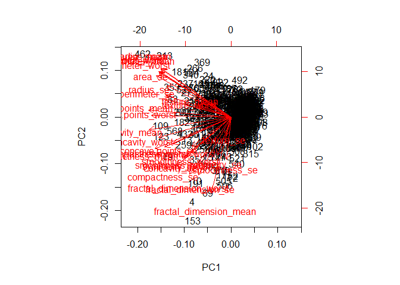
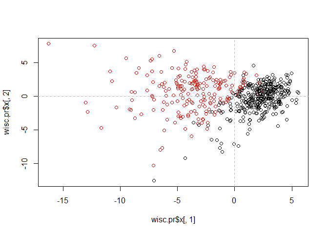
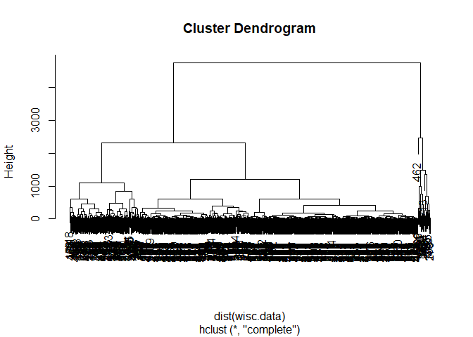
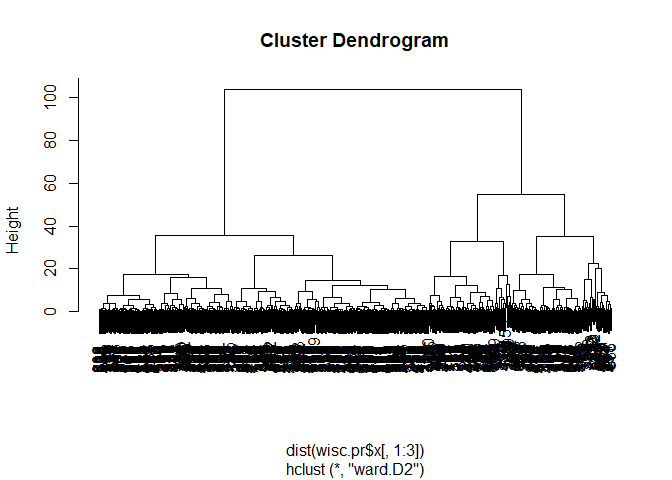
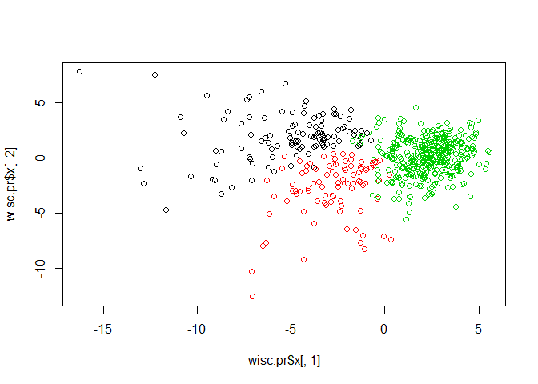
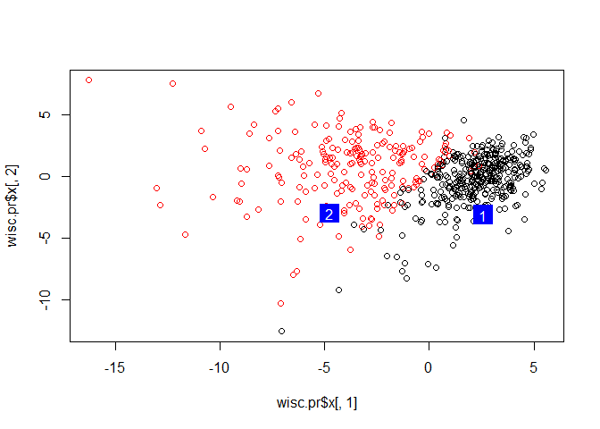

Class 10
================
Sarra Larif
2/6/2020

\#\#Scaling Sometimes we use different scales to compare things (meters
vs. ft) `prcomp(x, SCALE = TRUE)` scales the data before PCA (normally
scale = false so it doesn’t scale)

\#\#Analysis of Human Breast Cancer

``` r
#Import the data from the link in the class website and store as wisc.df
wisc.df <- read.csv("WisconsinCancer.csv")
head(wisc.df)
```

    ##         id diagnosis radius_mean texture_mean perimeter_mean area_mean
    ## 1   842302         M       17.99        10.38         122.80    1001.0
    ## 2   842517         M       20.57        17.77         132.90    1326.0
    ## 3 84300903         M       19.69        21.25         130.00    1203.0
    ## 4 84348301         M       11.42        20.38          77.58     386.1
    ## 5 84358402         M       20.29        14.34         135.10    1297.0
    ## 6   843786         M       12.45        15.70          82.57     477.1
    ##   smoothness_mean compactness_mean concavity_mean concave.points_mean
    ## 1         0.11840          0.27760         0.3001             0.14710
    ## 2         0.08474          0.07864         0.0869             0.07017
    ## 3         0.10960          0.15990         0.1974             0.12790
    ## 4         0.14250          0.28390         0.2414             0.10520
    ## 5         0.10030          0.13280         0.1980             0.10430
    ## 6         0.12780          0.17000         0.1578             0.08089
    ##   symmetry_mean fractal_dimension_mean radius_se texture_se perimeter_se
    ## 1        0.2419                0.07871    1.0950     0.9053        8.589
    ## 2        0.1812                0.05667    0.5435     0.7339        3.398
    ## 3        0.2069                0.05999    0.7456     0.7869        4.585
    ## 4        0.2597                0.09744    0.4956     1.1560        3.445
    ## 5        0.1809                0.05883    0.7572     0.7813        5.438
    ## 6        0.2087                0.07613    0.3345     0.8902        2.217
    ##   area_se smoothness_se compactness_se concavity_se concave.points_se
    ## 1  153.40      0.006399        0.04904      0.05373           0.01587
    ## 2   74.08      0.005225        0.01308      0.01860           0.01340
    ## 3   94.03      0.006150        0.04006      0.03832           0.02058
    ## 4   27.23      0.009110        0.07458      0.05661           0.01867
    ## 5   94.44      0.011490        0.02461      0.05688           0.01885
    ## 6   27.19      0.007510        0.03345      0.03672           0.01137
    ##   symmetry_se fractal_dimension_se radius_worst texture_worst perimeter_worst
    ## 1     0.03003             0.006193        25.38         17.33          184.60
    ## 2     0.01389             0.003532        24.99         23.41          158.80
    ## 3     0.02250             0.004571        23.57         25.53          152.50
    ## 4     0.05963             0.009208        14.91         26.50           98.87
    ## 5     0.01756             0.005115        22.54         16.67          152.20
    ## 6     0.02165             0.005082        15.47         23.75          103.40
    ##   area_worst smoothness_worst compactness_worst concavity_worst
    ## 1     2019.0           0.1622            0.6656          0.7119
    ## 2     1956.0           0.1238            0.1866          0.2416
    ## 3     1709.0           0.1444            0.4245          0.4504
    ## 4      567.7           0.2098            0.8663          0.6869
    ## 5     1575.0           0.1374            0.2050          0.4000
    ## 6      741.6           0.1791            0.5249          0.5355
    ##   concave.points_worst symmetry_worst fractal_dimension_worst  X
    ## 1               0.2654         0.4601                 0.11890 NA
    ## 2               0.1860         0.2750                 0.08902 NA
    ## 3               0.2430         0.3613                 0.08758 NA
    ## 4               0.2575         0.6638                 0.17300 NA
    ## 5               0.1625         0.2364                 0.07678 NA
    ## 6               0.1741         0.3985                 0.12440 NA

M = malignant, B = benign Column X is full of NAs (problem) ID column is
zip codes that aren’t supposed to be there because good neighborhoods
showed treatment success and bad neighborhoods didn’t Don’t want
Diagnosis either because that’s the answer and don’t want X

``` r
wisc.data <- as.matrix(wisc.df[,3:32])
head(wisc.data)
```

    ##      radius_mean texture_mean perimeter_mean area_mean smoothness_mean
    ## [1,]       17.99        10.38         122.80    1001.0         0.11840
    ## [2,]       20.57        17.77         132.90    1326.0         0.08474
    ## [3,]       19.69        21.25         130.00    1203.0         0.10960
    ## [4,]       11.42        20.38          77.58     386.1         0.14250
    ## [5,]       20.29        14.34         135.10    1297.0         0.10030
    ## [6,]       12.45        15.70          82.57     477.1         0.12780
    ##      compactness_mean concavity_mean concave.points_mean symmetry_mean
    ## [1,]          0.27760         0.3001             0.14710        0.2419
    ## [2,]          0.07864         0.0869             0.07017        0.1812
    ## [3,]          0.15990         0.1974             0.12790        0.2069
    ## [4,]          0.28390         0.2414             0.10520        0.2597
    ## [5,]          0.13280         0.1980             0.10430        0.1809
    ## [6,]          0.17000         0.1578             0.08089        0.2087
    ##      fractal_dimension_mean radius_se texture_se perimeter_se area_se
    ## [1,]                0.07871    1.0950     0.9053        8.589  153.40
    ## [2,]                0.05667    0.5435     0.7339        3.398   74.08
    ## [3,]                0.05999    0.7456     0.7869        4.585   94.03
    ## [4,]                0.09744    0.4956     1.1560        3.445   27.23
    ## [5,]                0.05883    0.7572     0.7813        5.438   94.44
    ## [6,]                0.07613    0.3345     0.8902        2.217   27.19
    ##      smoothness_se compactness_se concavity_se concave.points_se symmetry_se
    ## [1,]      0.006399        0.04904      0.05373           0.01587     0.03003
    ## [2,]      0.005225        0.01308      0.01860           0.01340     0.01389
    ## [3,]      0.006150        0.04006      0.03832           0.02058     0.02250
    ## [4,]      0.009110        0.07458      0.05661           0.01867     0.05963
    ## [5,]      0.011490        0.02461      0.05688           0.01885     0.01756
    ## [6,]      0.007510        0.03345      0.03672           0.01137     0.02165
    ##      fractal_dimension_se radius_worst texture_worst perimeter_worst area_worst
    ## [1,]             0.006193        25.38         17.33          184.60     2019.0
    ## [2,]             0.003532        24.99         23.41          158.80     1956.0
    ## [3,]             0.004571        23.57         25.53          152.50     1709.0
    ## [4,]             0.009208        14.91         26.50           98.87      567.7
    ## [5,]             0.005115        22.54         16.67          152.20     1575.0
    ## [6,]             0.005082        15.47         23.75          103.40      741.6
    ##      smoothness_worst compactness_worst concavity_worst concave.points_worst
    ## [1,]           0.1622            0.6656          0.7119               0.2654
    ## [2,]           0.1238            0.1866          0.2416               0.1860
    ## [3,]           0.1444            0.4245          0.4504               0.2430
    ## [4,]           0.2098            0.8663          0.6869               0.2575
    ## [5,]           0.1374            0.2050          0.4000               0.1625
    ## [6,]           0.1791            0.5249          0.5355               0.1741
    ##      symmetry_worst fractal_dimension_worst
    ## [1,]         0.4601                 0.11890
    ## [2,]         0.2750                 0.08902
    ## [3,]         0.3613                 0.08758
    ## [4,]         0.6638                 0.17300
    ## [5,]         0.2364                 0.07678
    ## [6,]         0.3985                 0.12440

``` r
#how many patients in this data set?
nrow(wisc.data)
```

    ## [1] 569

``` r
#how many Ms and Bs?
table(wisc.df$diagnosis)
```

    ## 
    ##   B   M 
    ## 357 212

``` r
#how many variables/features in data are suffixed with _mean?
grep("_mean", colnames(wisc.df), value=TRUE)
```

    ##  [1] "radius_mean"            "texture_mean"           "perimeter_mean"        
    ##  [4] "area_mean"              "smoothness_mean"        "compactness_mean"      
    ##  [7] "concavity_mean"         "concave.points_mean"    "symmetry_mean"         
    ## [10] "fractal_dimension_mean"

``` r
#value = TRUE tells you what they are 
length(grep("_mean", colnames(wisc.df)))
```

    ## [1] 10

\#\#Principal Component Analysis Before we use PCA we need to consider
if we need to scale `scale = TRUE`

``` r
colMeans(wisc.data)
```

    ##             radius_mean            texture_mean          perimeter_mean 
    ##            1.412729e+01            1.928965e+01            9.196903e+01 
    ##               area_mean         smoothness_mean        compactness_mean 
    ##            6.548891e+02            9.636028e-02            1.043410e-01 
    ##          concavity_mean     concave.points_mean           symmetry_mean 
    ##            8.879932e-02            4.891915e-02            1.811619e-01 
    ##  fractal_dimension_mean               radius_se              texture_se 
    ##            6.279761e-02            4.051721e-01            1.216853e+00 
    ##            perimeter_se                 area_se           smoothness_se 
    ##            2.866059e+00            4.033708e+01            7.040979e-03 
    ##          compactness_se            concavity_se       concave.points_se 
    ##            2.547814e-02            3.189372e-02            1.179614e-02 
    ##             symmetry_se    fractal_dimension_se            radius_worst 
    ##            2.054230e-02            3.794904e-03            1.626919e+01 
    ##           texture_worst         perimeter_worst              area_worst 
    ##            2.567722e+01            1.072612e+02            8.805831e+02 
    ##        smoothness_worst       compactness_worst         concavity_worst 
    ##            1.323686e-01            2.542650e-01            2.721885e-01 
    ##    concave.points_worst          symmetry_worst fractal_dimension_worst 
    ##            1.146062e-01            2.900756e-01            8.394582e-02

``` r
apply(wisc.data,2,sd) #apply standard deviation across (1 for rows or 2 for columns) in data set
```

    ##             radius_mean            texture_mean          perimeter_mean 
    ##            3.524049e+00            4.301036e+00            2.429898e+01 
    ##               area_mean         smoothness_mean        compactness_mean 
    ##            3.519141e+02            1.406413e-02            5.281276e-02 
    ##          concavity_mean     concave.points_mean           symmetry_mean 
    ##            7.971981e-02            3.880284e-02            2.741428e-02 
    ##  fractal_dimension_mean               radius_se              texture_se 
    ##            7.060363e-03            2.773127e-01            5.516484e-01 
    ##            perimeter_se                 area_se           smoothness_se 
    ##            2.021855e+00            4.549101e+01            3.002518e-03 
    ##          compactness_se            concavity_se       concave.points_se 
    ##            1.790818e-02            3.018606e-02            6.170285e-03 
    ##             symmetry_se    fractal_dimension_se            radius_worst 
    ##            8.266372e-03            2.646071e-03            4.833242e+00 
    ##           texture_worst         perimeter_worst              area_worst 
    ##            6.146258e+00            3.360254e+01            5.693570e+02 
    ##        smoothness_worst       compactness_worst         concavity_worst 
    ##            2.283243e-02            1.573365e-01            2.086243e-01 
    ##    concave.points_worst          symmetry_worst fractal_dimension_worst 
    ##            6.573234e-02            6.186747e-02            1.806127e-02

Want to rounf everything to 2 sig figs

``` r
round(apply(wisc.data,2,sd),2)
```

    ##             radius_mean            texture_mean          perimeter_mean 
    ##                    3.52                    4.30                   24.30 
    ##               area_mean         smoothness_mean        compactness_mean 
    ##                  351.91                    0.01                    0.05 
    ##          concavity_mean     concave.points_mean           symmetry_mean 
    ##                    0.08                    0.04                    0.03 
    ##  fractal_dimension_mean               radius_se              texture_se 
    ##                    0.01                    0.28                    0.55 
    ##            perimeter_se                 area_se           smoothness_se 
    ##                    2.02                   45.49                    0.00 
    ##          compactness_se            concavity_se       concave.points_se 
    ##                    0.02                    0.03                    0.01 
    ##             symmetry_se    fractal_dimension_se            radius_worst 
    ##                    0.01                    0.00                    4.83 
    ##           texture_worst         perimeter_worst              area_worst 
    ##                    6.15                   33.60                  569.36 
    ##        smoothness_worst       compactness_worst         concavity_worst 
    ##                    0.02                    0.16                    0.21 
    ##    concave.points_worst          symmetry_worst fractal_dimension_worst 
    ##                    0.07                    0.06                    0.02

Need to scale

``` r
wisc.pr <- prcomp(wisc.data, scale = TRUE)
summary(wisc.pr)
```

    ## Importance of components:
    ##                           PC1    PC2     PC3     PC4     PC5     PC6     PC7
    ## Standard deviation     3.6444 2.3857 1.67867 1.40735 1.28403 1.09880 0.82172
    ## Proportion of Variance 0.4427 0.1897 0.09393 0.06602 0.05496 0.04025 0.02251
    ## Cumulative Proportion  0.4427 0.6324 0.72636 0.79239 0.84734 0.88759 0.91010
    ##                            PC8    PC9    PC10   PC11    PC12    PC13    PC14
    ## Standard deviation     0.69037 0.6457 0.59219 0.5421 0.51104 0.49128 0.39624
    ## Proportion of Variance 0.01589 0.0139 0.01169 0.0098 0.00871 0.00805 0.00523
    ## Cumulative Proportion  0.92598 0.9399 0.95157 0.9614 0.97007 0.97812 0.98335
    ##                           PC15    PC16    PC17    PC18    PC19    PC20   PC21
    ## Standard deviation     0.30681 0.28260 0.24372 0.22939 0.22244 0.17652 0.1731
    ## Proportion of Variance 0.00314 0.00266 0.00198 0.00175 0.00165 0.00104 0.0010
    ## Cumulative Proportion  0.98649 0.98915 0.99113 0.99288 0.99453 0.99557 0.9966
    ##                           PC22    PC23   PC24    PC25    PC26    PC27    PC28
    ## Standard deviation     0.16565 0.15602 0.1344 0.12442 0.09043 0.08307 0.03987
    ## Proportion of Variance 0.00091 0.00081 0.0006 0.00052 0.00027 0.00023 0.00005
    ## Cumulative Proportion  0.99749 0.99830 0.9989 0.99942 0.99969 0.99992 0.99997
    ##                           PC29    PC30
    ## Standard deviation     0.02736 0.01153
    ## Proportion of Variance 0.00002 0.00000
    ## Cumulative Proportion  1.00000 1.00000

Q4. proportion of variance = can plot 44% of data in PC1 - The 1st PC
captures 44.27% of the original variance. looking for point where
there’s the biggest drop in percent variance exlpained (scree plot?)
Q5. 3 PCS Q6. 7 PCs

Let’s make some figures (visualize PCA results)

``` r
biplot(wisc.pr) 
```

<!-- -->

``` r
#wtf is this? we need to clean it up
```

``` r
#Tells you the different results we have in PCA
attributes(wisc.pr)
```

    ## $names
    ## [1] "sdev"     "rotation" "center"   "scale"    "x"       
    ## 
    ## $class
    ## [1] "prcomp"

``` r
#plot x of PCA 1 vs x of PCA 2 coloring by if its malignant or benign
plot(wisc.pr$x[,1], wisc.pr$x[,2], col=wisc.df$diagnosis)
```

<!-- --> Red and
black are split but red is more spread out and there is a small mixture
of malignant and benign but there is a spread so we should look into it
more (0,0) is mean of all the columns Tight clustering of black means
there aren’t many ways to look benign (black) but there are many ways to
look malignant (red) Maximum variation of data is between the minimum
and maximum of data (line along dots on page 21 of slides) take midpoint
as zero and genes on end can have plus and minus values so that absolute
value of higher number means more variation/higher influence PC1 and PC2
are each an axis(?) Each point represents a column of data by plotting
its influence on PC1 vs. its influence on PC2 getting points near each
other (clustering) means they behave similarly

``` r
#Add average lines to visualize easier 
plot(wisc.pr$x[,1], wisc.pr$x[,2], col=wisc.df$diagnosis)
abline(h=0, col="gray", lty=2)
abline(v=0, col="gray", lty=2)
```

<!-- --> malignant
and benign are fairly similar and cluster around average?

\#\#\#Cluster in PC space can you take the raw data and cluster it? Yes
but it looks terrible Let’s see if we can do it

``` r
km <- kmeans(wisc.data, centers = 2, nstart = 20)
hc <- hclust(dist(wisc.data))
plot(hc)
```

<!-- --> Uneven
distribution because the data doesn’t really have good means of
clustering instead of raw data, let’s give it the results of the
principal component analysis Using the minimum number of principal
components required to describe at least 90% of the variability in the
data, create a hierarchical clustering model with the linkage
method=“ward.D2”. We use Ward’s criterion here because it is based on
multidimensional variance like principal components analysis. Assign the
results to wisc.pr.hclust.

``` r
wisc.pr.hclust <- hclust(dist(wisc.pr$x[,1:3]), method = "ward.D2")
plot(wisc.pr.hclust)
```

<!-- --> To get out
clusters out of this tree we need to CUT it with `cutree()`

``` r
grps3 <- cutree(wisc.pr.hclust, k=3)
grps3
```

    ##   [1] 1 1 1 2 1 2 1 2 2 2 3 2 1 3 2 2 3 2 1 3 3 3 2 1 1 1 2 1 2 3 1 2 2 1 2 2 2
    ##  [38] 3 3 2 3 2 1 2 3 2 3 2 3 3 3 3 3 1 3 3 1 2 3 3 3 3 2 3 2 2 3 3 2 3 1 2 2 3
    ##  [75] 3 3 3 1 1 3 3 2 1 1 3 1 3 1 3 2 3 3 3 3 2 1 3 3 3 2 3 3 3 3 3 2 3 3 1 3 3
    ## [112] 3 2 3 3 3 3 2 2 3 3 1 1 3 3 3 3 1 2 1 3 1 1 3 1 3 3 3 1 3 3 3 3 3 3 3 2 3
    ## [149] 3 3 3 2 2 3 3 3 1 3 3 3 3 1 1 3 1 3 3 3 1 3 3 3 2 3 3 3 2 2 3 3 1 1 1 3 3
    ## [186] 3 3 3 3 3 2 3 3 2 2 3 2 1 1 2 3 1 1 2 3 3 3 3 2 3 1 3 1 2 2 2 3 3 1 1 3 3
    ## [223] 3 2 3 3 3 3 3 2 2 3 3 1 3 3 1 1 3 1 3 3 2 3 1 3 3 2 3 3 1 3 1 1 1 2 1 2 1
    ## [260] 2 1 3 1 3 1 1 3 3 3 3 3 3 1 3 3 3 3 3 3 3 1 3 1 2 3 3 3 3 2 3 2 3 3 3 3 3
    ## [297] 3 3 3 3 1 3 1 3 3 3 3 3 3 3 3 3 3 3 3 3 3 1 2 3 3 1 3 1 3 3 3 3 2 2 2 3 3
    ## [334] 3 3 1 3 1 3 1 2 3 3 1 3 3 3 3 3 3 3 2 1 2 3 3 3 3 3 3 3 3 3 3 3 1 1 3 1 1
    ## [371] 2 3 1 1 3 3 2 3 3 2 3 3 3 3 3 3 3 3 3 1 3 3 2 1 3 3 3 3 3 3 2 3 3 3 3 3 3
    ## [408] 3 1 3 3 3 3 3 3 3 3 1 3 3 3 2 3 3 3 3 3 3 3 3 2 3 1 1 3 2 3 3 3 3 3 1 3 3
    ## [445] 1 3 1 3 3 1 3 1 3 3 3 3 3 3 3 3 1 1 3 3 3 2 3 3 1 3 3 3 3 3 3 3 3 3 3 2 3
    ## [482] 3 3 3 3 2 3 1 3 3 3 3 1 3 3 3 2 3 1 1 3 2 3 1 2 2 3 3 3 2 3 3 2 3 3 3 1 1
    ## [519] 3 3 3 1 3 3 3 3 3 3 3 3 3 3 3 1 3 1 2 3 3 3 3 2 3 3 3 3 3 3 3 3 3 3 3 3 3
    ## [556] 3 3 3 3 3 3 3 2 1 1 1 3 1 3

``` r
table(grps3) #how many data points are in each group
```

    ## grps3
    ##   1   2   3 
    ## 111  92 366

``` r
plot(wisc.pr$x[,1], wisc.pr$x[,2], col=grps3)
```

<!-- --> green seems
to be benign and black and red seem to be malignant Let’s check: we can
use the `table()` function to compare $diagnosis vector with out cluster
results vector

``` r
table(grps3, wisc.df$diagnosis)
```

    ##      
    ## grps3   B   M
    ##     1   0 111
    ##     2  24  68
    ##     3 333  33

``` r
grps2 <- cutree(wisc.pr.hclust, k=2)
plot(wisc.pr$x[,1], wisc.pr$x[,2], col=grps2)
```

<!-- -->

``` r
table(grps2, wisc.df$diagnosis)
```

    ##      
    ## grps2   B   M
    ##     1  24 179
    ##     2 333  33

in cluster 1 you have 24 benign patients but 333 benign patients in
cluster 2; malignant has 179 in cluster 1 and 33 in cluster 2(24 and 33
misdiagnosed) Balance of sensitivity vs. specificity

\#\#Prediction We will use the `predict()` function that will take our
PCA model from before and new cancer cell data and project that into our
PCA space

``` r
new <- read.csv("new_samples.csv")
new
```

    ##   radius_mean texture_mean perimeter_mean area_mean smoothness_mean
    ## 1       8.598        20.98          54.66     221.8          0.1243
    ## 2      14.250        22.15          96.42     645.7          0.1049
    ##   compactness_mean concavity_mean concave.points_mean symmetry_mean
    ## 1          0.08963         0.0300            0.009259        0.1828
    ## 2          0.20080         0.2135            0.086530        0.1949
    ##   fractal_dimension_mean radius_se texture_se perimeter_se area_se
    ## 1                0.06757    0.3582      2.067        2.493   18.39
    ## 2                0.07292    0.7036      1.268        5.373   60.78
    ##   smoothness_se compactness_se concavity_se concave.points_se symmetry_se
    ## 1      0.011930        0.03162      0.03000          0.009259     0.03357
    ## 2      0.009407        0.07056      0.06899          0.018480     0.01700
    ##   fractal_dimension_se radius_worst texture_worst perimeter_worst area_worst
    ## 1             0.003048        9.565         27.04           62.06      273.9
    ## 2             0.006113       17.670         29.51          119.10      959.5
    ##   smoothness_worst compactness_worst concavity_worst concave.points_worst
    ## 1           0.1639            0.1698         0.09001              0.02778
    ## 2           0.1640            0.6247         0.69220              0.17850
    ##   symmetry_worst fractal_dimension_worst
    ## 1         0.2972                 0.07712
    ## 2         0.2844                 0.11320

Use `predict()` with our previous PCA model and new data…

``` r
npc <- predict(wisc.pr, newdata = new)
npc
```

    ##            PC1       PC2        PC3        PC4       PC5        PC6        PC7
    ## [1,]  2.576616 -3.135913  1.3990492 -0.7631950  2.781648 -0.8150185 -0.3959098
    ## [2,] -4.754928 -3.009033 -0.1660946 -0.6052952 -1.140698 -1.2189945  0.8193031
    ##             PC8       PC9       PC10      PC11      PC12      PC13     PC14
    ## [1,] -0.2307350 0.1029569 -0.9272861 0.3411457  0.375921 0.1610764 1.187882
    ## [2,] -0.3307423 0.5281896 -0.4855301 0.7173233 -1.185917 0.5893856 0.303029
    ##           PC15       PC16        PC17        PC18        PC19       PC20
    ## [1,] 0.3216974 -0.1743616 -0.07875393 -0.11207028 -0.08802955 -0.2495216
    ## [2,] 0.1299153  0.1448061 -0.40509706  0.06565549  0.25591230 -0.4289500
    ##            PC21       PC22       PC23       PC24        PC25         PC26
    ## [1,]  0.1228233 0.09358453 0.08347651  0.1223396  0.02124121  0.078884581
    ## [2,] -0.1224776 0.01732146 0.06316631 -0.2338618 -0.20755948 -0.009833238
    ##              PC27        PC28         PC29         PC30
    ## [1,]  0.220199544 -0.02946023 -0.015620933  0.005269029
    ## [2,] -0.001134152  0.09638361  0.002795349 -0.019015820

Now draw the PCA plot and add new data:

``` r
plot(wisc.pr$x[,1], wisc.pr$x[,2], col=wisc.df$diagnosis)
points(npc[,1], npc[,2], col ="blue", pch=15, cex=3)
text(npc[,1], npc[,2], labels = c(1,2), col="white")
```

<!-- --> Want to
prioritize patient 2 for checks because matches malignant clustering
