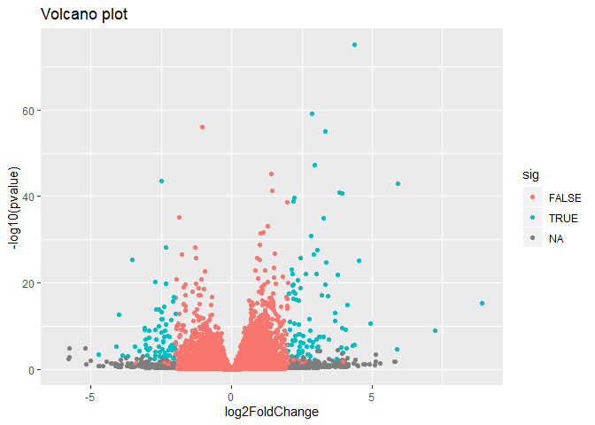

Class 14 (Lecture 15): Transcriptomics and the Analysis of RNA-seq data
================
Sarra Larif
2/20/2020

Install BiocManager `install.packages("BiocManager")`
`BiocManager::install()` For this class, you’ll also need DESeq2:
`BiocManager::install("DESeq2")` `library(DESeq2)`

\#\#Import Today’s Data

The data for this hands-on session comes from a published RNA-seq
experiment where airway smooth muscle cells were treated with
dexamethasone, a synthetic glucocorticoid steroid with anti-inflammatory
effects (Himes et al. 2014).

Glucocorticoids are used, for example, by people with asthma to reduce
inflammation of the airways. The anti-inflammatory effects on airway
smooth muscle (ASM) cells has been known for some time but the
underlying molecular mechanisms are unclear.

``` r
counts <- read.csv("airway_scaledcounts.csv", stringsAsFactors = FALSE)
metadata <-  read.csv("airway_metadata.csv", stringsAsFactors = FALSE)
```

The rows in “counts” correspond to the columns in “metadata” The numbers
are the counts of reads (number of fragments mapped to the gene)

Number of genes we are working with:

``` r
nrow(counts)
```

    ## [1] 38694

Average counts per gene for control samples and drug-treated samples
then compare these values to see if there is a difference in the control
and treated samples for a given gene:

``` r
metadata$dex == "control"
```

    ## [1]  TRUE FALSE  TRUE FALSE  TRUE FALSE  TRUE FALSE

``` r
#Want the ID number for where it says TRUE
metadata$id[metadata$dex == "control"]
```

    ## [1] "SRR1039508" "SRR1039512" "SRR1039516" "SRR1039520"

``` r
#OR metadata[metadata$dex == "control", ]$id
```

This is our metadata info that tells us where our control and treated
samples are (which columns in `counts`) Access control only columns in
the metadata

``` r
control <- metadata[metadata$dex =="control",]
```

Now use the `$id` of the control data to access the control columns in
`counts` Do not want to just divide by 4 because if the data set size
changes then it’s wrong

``` r
control.mean <- rowSums(counts[, control$id])/nrow(control)
#Add gene names back on to vector for clarity
names(control.mean) <- counts$ensgene
head(control.mean)
```

    ## ENSG00000000003 ENSG00000000005 ENSG00000000419 ENSG00000000457 ENSG00000000460 
    ##          900.75            0.00          520.50          339.75           97.25 
    ## ENSG00000000938 
    ##            0.75

Now do the same thing for the `treated` columns

``` r
treated <- metadata[metadata$dex == "treated", ]
treated.mean <- rowSums(counts[, treated$id])/nrow(treated)
names(treated.mean) <- counts$ensgene
head(treated.mean)
```

    ## ENSG00000000003 ENSG00000000005 ENSG00000000419 ENSG00000000457 ENSG00000000460 
    ##          658.00            0.00          546.00          316.50           78.75 
    ## ENSG00000000938 
    ##            0.00

Now want to make a dataframe with both mean sets

``` r
meancounts <- data.frame(control.mean, treated.mean)
head(meancounts)
```

    ##                 control.mean treated.mean
    ## ENSG00000000003       900.75       658.00
    ## ENSG00000000005         0.00         0.00
    ## ENSG00000000419       520.50       546.00
    ## ENSG00000000457       339.75       316.50
    ## ENSG00000000460        97.25        78.75
    ## ENSG00000000938         0.75         0.00

Create a scatter plot to show the mean of the treated samples against
the mean of control samples

``` r
plot(meancounts, xlab = "Control", ylab = "Treated")
```

<!-- --> Use logs of
data to spread out data to open that cluster

``` r
plot.default(meancounts, log = "xy", xlab = "log Control", ylab = "log Treated")
```

    ## Warning in xy.coords(x, y, xlabel, ylabel, log): 15032 x values <= 0 omitted
    ## from logarithmic plot

    ## Warning in xy.coords(x, y, xlabel, ylabel, log): 15281 y values <= 0 omitted
    ## from logarithmic plot

<!-- --> If above
diagonal, it’s upregulated in treated and if below diagonal the gene is
downregulated when treated

Now we want to divide the means so we can easily see upregulation or
downregulation and make that a new column

``` r
meancounts$log2fc <- log2(meancounts[,"treated.mean"]/meancounts[,"control.mean"])
head(meancounts)
```

    ##                 control.mean treated.mean      log2fc
    ## ENSG00000000003       900.75       658.00 -0.45303916
    ## ENSG00000000005         0.00         0.00         NaN
    ## ENSG00000000419       520.50       546.00  0.06900279
    ## ENSG00000000457       339.75       316.50 -0.10226805
    ## ENSG00000000460        97.25        78.75 -0.30441833
    ## ENSG00000000938         0.75         0.00        -Inf

NaN means it’s trying to take the log of zero (the gene is not active in
either treatment)

Remove any gene that has zero average counts.

``` r
#arr.ind gives row and column indeces to tell you where in the table the value is zero
zero.vals <- which(meancounts[,1:2]==0, arr.ind=TRUE)

to.rm <- unique(zero.vals[,1])
mycounts <- meancounts[-to.rm,]
head(mycounts)
```

    ##                 control.mean treated.mean      log2fc
    ## ENSG00000000003       900.75       658.00 -0.45303916
    ## ENSG00000000419       520.50       546.00  0.06900279
    ## ENSG00000000457       339.75       316.50 -0.10226805
    ## ENSG00000000460        97.25        78.75 -0.30441833
    ## ENSG00000000971      5219.00      6687.50  0.35769358
    ## ENSG00000001036      2327.00      1785.75 -0.38194109

How many genes do I have left?

``` r
nrow(mycounts)
```

    ## [1] 21817

Want to narrow down to the genes that are affected by the drug (if it’s
more than 2 (upregulated) or less than -2 (downregulated) we consider it
a big change)

``` r
up.ind <- mycounts$log2fc > 2
down.ind <- mycounts$log2fc < (-2)
#These give logicals (TRUE/FALSE)
```

Want number of genes

``` r
sum(up.ind)
```

    ## [1] 250

``` r
sum(down.ind)
```

    ## [1] 367

\#\#Do this properly with DESeq2

``` r
library(DESeq2)
```

    ## Loading required package: S4Vectors

    ## Loading required package: stats4

    ## Loading required package: BiocGenerics

    ## Loading required package: parallel

    ## 
    ## Attaching package: 'BiocGenerics'

    ## The following objects are masked from 'package:parallel':
    ## 
    ##     clusterApply, clusterApplyLB, clusterCall, clusterEvalQ,
    ##     clusterExport, clusterMap, parApply, parCapply, parLapply,
    ##     parLapplyLB, parRapply, parSapply, parSapplyLB

    ## The following objects are masked from 'package:stats':
    ## 
    ##     IQR, mad, sd, var, xtabs

    ## The following objects are masked from 'package:base':
    ## 
    ##     anyDuplicated, append, as.data.frame, basename, cbind, colnames,
    ##     dirname, do.call, duplicated, eval, evalq, Filter, Find, get, grep,
    ##     grepl, intersect, is.unsorted, lapply, Map, mapply, match, mget,
    ##     order, paste, pmax, pmax.int, pmin, pmin.int, Position, rank,
    ##     rbind, Reduce, rownames, sapply, setdiff, sort, table, tapply,
    ##     union, unique, unsplit, which, which.max, which.min

    ## 
    ## Attaching package: 'S4Vectors'

    ## The following object is masked from 'package:base':
    ## 
    ##     expand.grid

    ## Loading required package: IRanges

    ## 
    ## Attaching package: 'IRanges'

    ## The following object is masked from 'package:grDevices':
    ## 
    ##     windows

    ## Loading required package: GenomicRanges

    ## Loading required package: GenomeInfoDb

    ## Loading required package: SummarizedExperiment

    ## Loading required package: Biobase

    ## Welcome to Bioconductor
    ## 
    ##     Vignettes contain introductory material; view with
    ##     'browseVignettes()'. To cite Bioconductor, see
    ##     'citation("Biobase")', and for packages 'citation("pkgname")'.

    ## Loading required package: DelayedArray

    ## Loading required package: matrixStats

    ## 
    ## Attaching package: 'matrixStats'

    ## The following objects are masked from 'package:Biobase':
    ## 
    ##     anyMissing, rowMedians

    ## Loading required package: BiocParallel

    ## 
    ## Attaching package: 'DelayedArray'

    ## The following objects are masked from 'package:matrixStats':
    ## 
    ##     colMaxs, colMins, colRanges, rowMaxs, rowMins, rowRanges

    ## The following objects are masked from 'package:base':
    ## 
    ##     aperm, apply, rowsum

Setup input for DESeq by specifying countdata, metadata and the
experiment design (i.e. which comparisons we are interested in)

``` r
dds <- DESeqDataSetFromMatrix(countData=counts, 
                              colData=metadata, 
                              design=~dex, 
                              tidy=TRUE)
```

    ## converting counts to integer mode

    ## Warning in DESeqDataSet(se, design = design, ignoreRank): some variables in
    ## design formula are characters, converting to factors

``` r
dds
```

    ## class: DESeqDataSet 
    ## dim: 38694 8 
    ## metadata(1): version
    ## assays(1): counts
    ## rownames(38694): ENSG00000000003 ENSG00000000005 ... ENSG00000283120
    ##   ENSG00000283123
    ## rowData names(0):
    ## colnames(8): SRR1039508 SRR1039509 ... SRR1039520 SRR1039521
    ## colData names(4): id dex celltype geo_id

Run main function and put results back into the name we gave

``` r
dds <- DESeq(dds)
```

    ## estimating size factors

    ## estimating dispersions

    ## gene-wise dispersion estimates

    ## mean-dispersion relationship

    ## final dispersion estimates

    ## fitting model and testing

``` r
res <- results(dds)
```

\#\#\#Volcano plot: All the points are the genes and the 0 means no
change and we are graphing the log of the fold change vs. the -log of
the pvalue To the right of 0 is upregulated genes and to the left of 0
is the downregulated genes

``` r
plot(res$log2FoldChange, res$padj)
```

<!-- -->

``` r
#This gives an unusual plot but we are only interested in very low p values so we have to narrow
```

``` r
res$sig <- res$padj<0.05 & abs(res$log2FoldChange)>2

# How many of each?
table(res$sig)
```

    ## 
    ## FALSE  TRUE 
    ## 24282   167

``` r
sum(is.na(res$sig))
```

    ## [1] 14245

``` r
palette(c("gray", "blue"))
plot(res$log2FoldChange, -log(res$padj), col = res$sig+1, ylab = "-Log(P-value)", xlab="Log2(FoldChange)")
abline(v=c(-2,2), col="darkgray", lty=2)
abline(h=-log(0.1), col="darkgray", lty=2)
```

<!-- -->

``` r
#need -log to have data on bottom of page, not top
#We want to highlight 2-fold changes (log2>2) and statistical significance (p<0.01)
```

Reset the color palette We could also setup a custom color vector
indicating transcripts with large fold change and significant
differences between conditions:

``` r
palette("default")  


# Setup our custom point color vector. Everything is gray unless it is more than 2 or less than -2
mycols <- rep("gray", nrow(res))
mycols[ abs(res$log2FoldChange) > 2 ]  <- "red" 

inds <- (res$padj < 0.01) & (abs(res$log2FoldChange) > 2 )
mycols[ inds ] <- "blue"

#Volcano plot with custom colors 
plot( res$log2FoldChange,  -log(res$padj), 
 col=mycols, ylab="-Log(P-value)", xlab="Log2(FoldChange)" )

abline(v=c(-2,2), col="gray", lty=2)
abline(h=-log(0.1), col="gray", lty=2)
```

<!-- -->

Can do same with `ggplot`

``` r
library(ggplot2)
ggplot(as.data.frame(res), aes(log2FoldChange, -log10(pvalue), col=sig)) + 
    geom_point() + 
    ggtitle("Volcano plot")
```

    ## Warning: Removed 13578 rows containing missing values (geom_point).

<!-- -->
