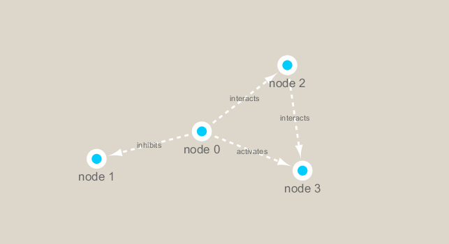

```{r setup, include=FALSE}
knitr::opts_chunk$set(echo = TRUE)
```

##Lecture Notes

###R  Quiz
To test what kind of data you can do `is.vector` or `is.matrix` for TRUE/FALSE

Can do math with logicals because they get coerced into 0 and 1 (True = 1, False = 0)

~ tells you to go to home directory 

Type "cd" into TERMINAL to be taken to home directory 
Typing "pwd" prints out where in your directory you are 
To go to a certain place you do "cd ____"
`makdir` makes a new directiry like a class folder 
To bring a file from a different location, you can read it in by typing through the entire path

~ is shortcut to home area 
`/Users/sarra/class/` OR `~/class/`
It's a shortcut for the user portion 

`ls../Downloads/HG00` makes you jump down into the "HG00" file from Downloads 

###Networks
Biological networks show you which genes have the biggest influence on the system 

When genes show high correlation, they are doing similar things with expression 

####Representations
Optional weight: Strength of interaction which determines width of line on network view 
Layout approach lays things out so they are visually interpretable 
-This works for networks of up to about 500 nodes but if you have anything bigger, you'd use a heatmap approach 

##Hands-On Part 1
If a gene has no data it will go to the default (def.) color so you want to change it
Once gene hits significance threshold (below 0.05) goes from circle to square (squares are significant)

Steps for Cytoscape: 
1. Expression.csu
2. Int.sif
3. Visiual attributes
4. Remove subset of edges for protein-protein interactions
5. Find area with the most "going on"

##Hands-On Part 2
Adjacency matrices are symmetric 
Hub genes(nodes) are the most susceptible points for diseases and losing them has the biggest impact on the networks 

###First setup the packages we need. These incude **igraph** from CRAN and **RCy3** from bioconductor
`install.packages("igraph")`
`BiocManager::install("RCy3")`

```{r}
library(RCy3)
library(igraph)
```

Let's check connection to cytoscape to make sure we can "talk" to it from R. Cytoscape must be running at this point.
```{r}
cytoscapePing()
```

Demo network from R to cytoscape
By using R we can automate the styles and data 
```{r}
g <- makeSimpleIgraph()
createNetworkFromIgraph(g, "myGraph")
```

Play with representations in cytoscape
```{r}
setVisualStyle("Marquee")
```

Save an image from cytoscape and include it in workbook
```{r}
fig <- exportImage(filename="demo_marquee", type="png", height=350)

```

We can also plot this simple network in R itself
```{r}
plot(g)
```

###Read our metagenomics data

Our data comes from the TARA oceans study 

```{r}
## scripts for processing located in "inst/data-raw/"
prok_vir_cor <- read.delim("virus_prok_cor_abundant.tsv", stringsAsFactors = FALSE)

## Have a peak at the first 6 rows
head(prok_vir_cor)
```
How many connections (i.e. edges) will we have in our network?
```{r}
nrow(prok_vir_cor)
```

Use the igraph function to make a network from this data.frame:
(We do not want a directed network because we do not know the order of interactions)
```{r}
g <- graph.data.frame(prok_vir_cor, directed = FALSE)
class(g)
g
plot(g)
```

Turn off the labels and reduce node size: 
```{r}
plot(g, vertex.label=NA, vertex.size=3)
```

Let;s send our graph to cytoscape:
```{r}
createNetworkFromIgraph(g, "myIgraph")
```

### Network community detection

Let's cluster our network to find "community" structure...
```{r}
cb <- cluster_edge_betweenness(g)
cb
```

```{r}
plot(cb, y=g, vertex.label=NA,  vertex.size=3)
```

```{r}
head(membership(cb))
```

###Centrality Analysis

Ranking nodes by which are more connected to each other
```{r}
pr <- page_rank(g)
head(pr$vector)
```


